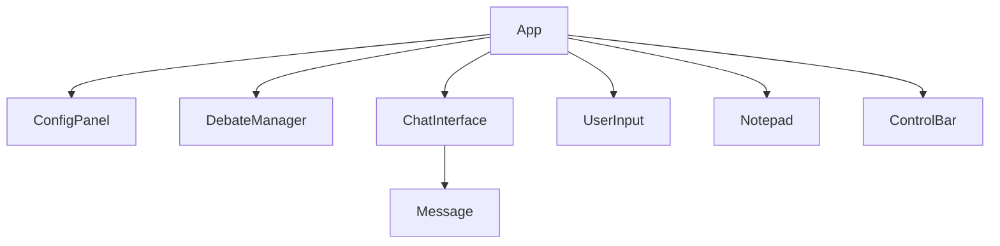
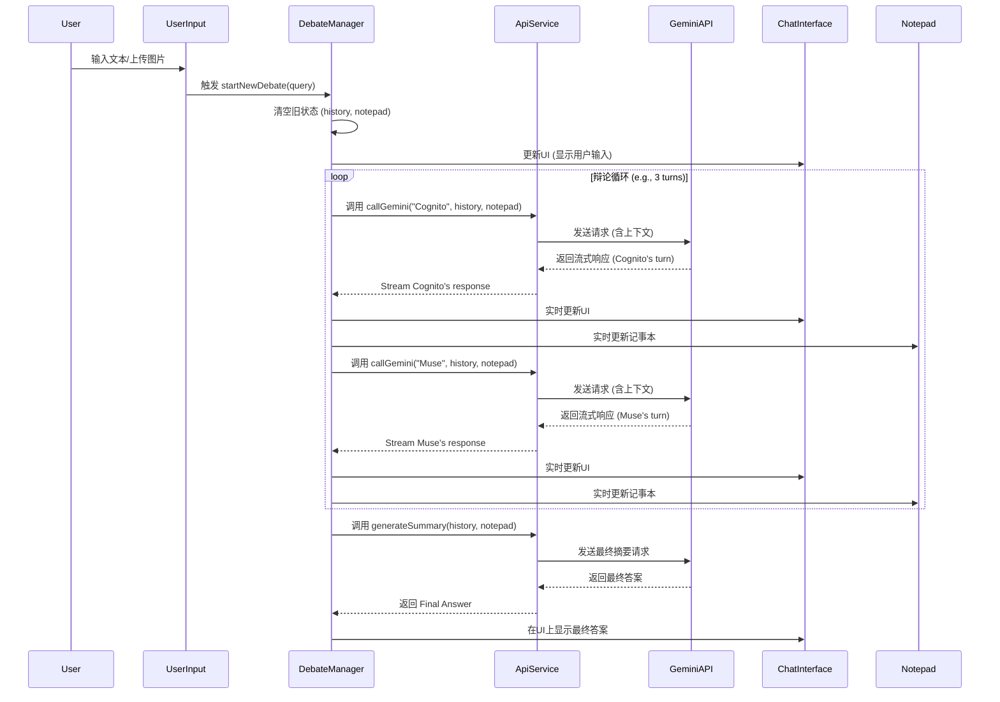

# GeminiDebateGame 前端架构设计

## 1. 概述

本文档基于 `SPECIFICATION.md`，为 `GeminiDebateGame` 应用设计了一个可扩展、模块化的前端架构。该架构旨在支持双 AI 辩论、多模态输入、实时状态同步和健壮的 API 交互。

## 2. 组件结构 (Component Structure)

应用界面将由一系列独立的 React 组件构成，以实现关注点分离和高可复用性。

### 2.1 主要组件及其职责

*   **`App`**: 根组件，负责整体布局和集成所有其他组件。
*   **`DebateManager`**: 核心逻辑容器，不直接渲染 UI，但负责编排整个辩论流程，管理状态转换和 API 调用。
*   **`ChatInterface`**: 主聊天界面，负责展示辩论历史记录 (`debateHistory`)。
    *   **`Message`**: 单条消息组件，根据角色（`User`, `Cognito`, `Muse`, `System`）展示不同的样式（头像、颜色）。
*   **`UserInput`**: 用户输入区域，包含文本输入框、图片上传按钮和提交按钮。
*   **`Notepad`**: 侧边栏或独立面板，用于实时展示 `sharedNotepadContent` 的内容，使用 `react-markdown` 渲染。
*   **`ConfigPanel`**: 配置面板，允许用户调整应用设置（`AppConfig`），如选择模型、讨论模式和预算模式。
*   **`ControlBar`**: 控制栏，包含“开始新辩论”、“停止生成”和“手动重试”等操作按钮。

### 2.2 组件层级关系图



## 3. 状态管理 (State Management)

### 3.1 核心状态

根据 `SPECIFICATION.md`，应用的核心状态包括：

*   `debateHistory: DebateTurn[]`: 存储整个辩论过程的对话历史。
*   `sharedNotepadContent: string`: 存储共享记事本的内容。
*   `currentUserQuery: { text: string; image?: string }`: 存储用户当前的输入（文本和 Base64 编码的图片）。
*   `appConfig: AppConfig`: 存储用户的配置选项。
*   `isLoading: boolean`: 标识 AI 是否正在生成内容，用于控制 UI 状态（如显示加载动画、禁用输入框）。
*   `errorState: { hasError: boolean; message: string }`: 存储 API 调用失败后的错误信息。

### 3.2 状态管理方案：Zustand

**选择理由**:

*   **简洁性**: Zustand 的 API 非常简单，无需像 Redux 那样编写大量的样板代码（actions, reducers, dispatchers）。
*   **轻量级**: 它非常小巧，对应用的包体积影响极小。
*   **易于集成**: 可以轻松地在任何 React 组件中使用，通过简单的 hook 即可访问和更新状态，避免了复杂的 `Context.Provider` 嵌套。
*   **性能**: Zustand 通过选择性订阅（selector）来避免不必要的组件重渲染，性能表现优异。

### 3.3 状态共享与更新

所有核心状态将由一个统一的 Zustand store 管理。

*   **`DebateManager`**: 将是状态更新的主要协调者。它会调用 API，并在成功或失败后更新 `debateHistory`, `sharedNotepadContent`, `isLoading` 和 `errorState`。
*   **`UserInput`**: 用户提交查询时，会更新 `currentUserQuery` 并触发 `DebateManager` 开始新的辩论。
*   **`ConfigPanel`**: 用户更改设置时，会直接更新 `appConfig` 对象。
*   **`ChatInterface` & `Notepad`**: 这些是纯展示组件，它们会订阅 store 中的 `debateHistory` 和 `sharedNotepadContent`，并在状态变化时自动重渲染。

**Zustand Store 示例**:

```typescript
import { create } from 'zustand';

// (Assuming types like DebateTurn, AppConfig are defined elsewhere)

interface AppState {
  debateHistory: DebateTurn[];
  sharedNotepadContent: string;
  appConfig: AppConfig;
  isLoading: boolean;
  // ... other states

  startNewDebate: (query: { text: string; image?: string }) => void;
  addTurnToHistory: (turn: DebateTurn) => void;
  updateNotepad: (content: string) => void;
  // ... other actions
}

export const useAppStore = create<AppState>((set, get) => ({
  // Initial state
  debateHistory: [],
  sharedNotepadContent: '',
  appConfig: { model: 'gemini-1.5-pro', discussionMode: 'fixed-turn', budgetMode: 'standard' },
  isLoading: false,

  // Actions
  startNewDebate: async (query) => {
    // This is where the DebateManager's logic would be triggered
    set({ isLoading: true, debateHistory: [{ role: 'User', content: query.text }] });
    // ... call API service
  },
  addTurnToHistory: (turn) => set((state) => ({ debateHistory: [...state.debateHistory, turn] })),
  updateNotepad: (content) => set((state) => ({ sharedNotepadContent: `${state.sharedNotepadContent}\n${content}` })),
}));
```

## 4. 数据流 (Data Flow)

下图描绘了从用户输入到最终答案呈现的完整数据流。



## 5. API 交互层 (API Interaction Layer)

为了将 API 相关的逻辑与业务逻辑解耦，我们将创建一个独立的 `ApiService` 模块。

### 5.1 职责

*   **封装 `fetch` 调用**: 所有与 Gemini API 的 `fetch` 请求都在此模块中进行。
*   **请求构建**: 根据传入的参数（角色、历史、记事本、配置）构建符合 Gemini API 规范的请求体。
*   **流式处理**: 处理 API 的流式响应，并以可消费的格式（如 `AsyncIterable`）返回给调用方。
*   **错误处理与重试**: 实现自动重试（指数退避）和错误包装。当所有重试失败后，抛出一个自定义错误，以便上层捕获并更新 UI。
*   **中断控制**: 集成 `AbortController`，提供一个 `abort()` 方法来中断正在进行的 `fetch` 请求。

### 5.2 伪代码示例

```typescript
// src/services/apiService.ts

import { useAppStore } from '../store'; // Access config and state

class ApiService {
  private abortController: AbortController;

  constructor() {
    this.abortController = new AbortController();
  }

  public async callGeminiStream(
    // params...
  ): Promise<AsyncIterable<string>> {
    this.abortController = new AbortController();
    const { appConfig } = useAppStore.getState();

    const requestBody = this.buildRequestBody(/* ... */);

    // Implement retry logic here (e.g., using a library like 'async-retry')
    try {
      const response = await fetch(`/api/gemini/${appConfig.model}`, {
        method: 'POST',
        signal: this.abortController.signal,
        body: JSON.stringify(requestBody),
      });

      if (!response.ok) {
        throw new Error(`API Error: ${response.statusText}`);
      }
      
      // Return a processed stream
      return this.processStream(response);

    } catch (error) {
      if (error.name === 'AbortError') {
        console.log('Request aborted.');
      }
      // Handle retry failure
      throw error;
    }
  }

  public abortRequest() {
    this.abortController.abort();
  }

  private buildRequestBody(/* ... */): object {
    // Logic to construct the request payload
    return {};
  }

  private async* processStream(response: Response): AsyncIterable<string> {
    // Logic to read and decode the stream
    const reader = response.body?.getReader();
    // ... yield chunks
  }
}

export const apiService = new ApiService();